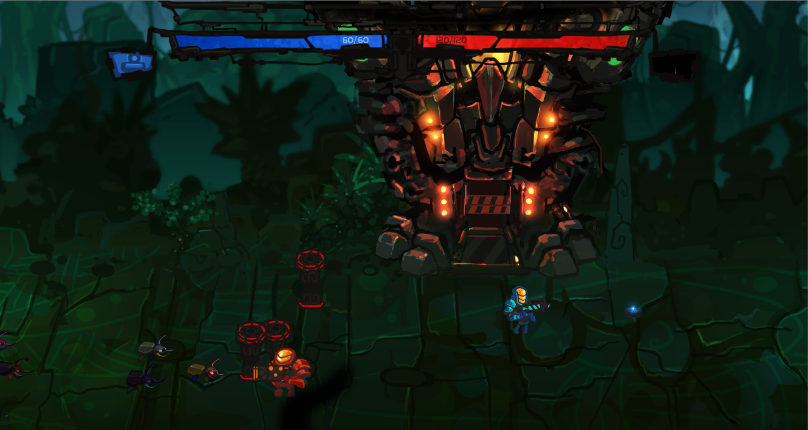

# LIFTOFF!

Liftoff is an arcade-feeling 2-player game, which was originally created during the 2016 Nordic Game Jam.
You and your partner have had problems with your spaceship and have landed on an unknown planet. Your engine is leaking and you have to survive the continous attack by the native creatures. Luckily your engine runs on bio-fuel...

Since the hackathon, we have continued to work on the game.
Beta builds for [Windows](https://drive.google.com/file/d/0B5eh7lJo7lMSZXdhMWR2N1padGs/edit), [Mac OS](), and [Linux](https://drive.google.com/file/d/0B5eh7lJo7lMSV0lwLXBBMWs5VE0/view) are available at [simoiliev.me](http://simoiliev.me/).